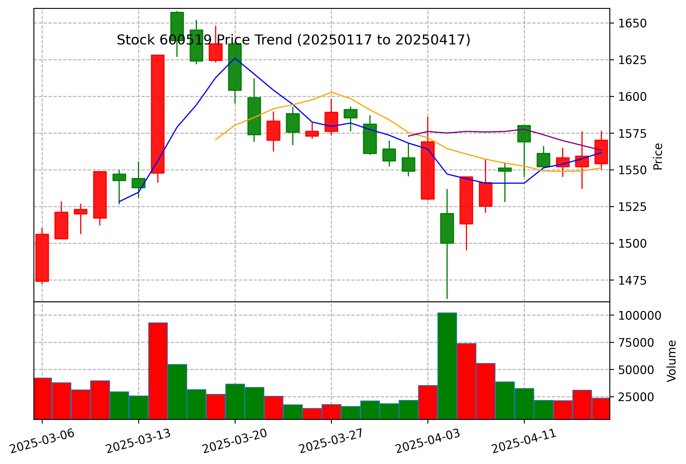

# A股分析助手

## MCP工具列表

本项目提供了4个核心MCP工具，可以在对话中调用：

1. **获取个股财务数据工具以及计算财务指标** - 提取东方财富和雪球的个股基本信息、实时盘口数据和历史行情数据，计算并分析市盈率、市净率、波动率等关键财务指标，提供综合评分
   ```py
   @mcp.tool()
   def get_one_stock_financial_data(symbol_em: str) -> str:
   ```
2. **股价走势跟踪工具** - 生成专业K线图并展示股票价格变动数据和技术指标
   ```py
   @mcp.tool()
   def track_stock_trend(symbol: str, period: str = "daily", days: int = 15) -> str:
   ```

3. **市场新闻分析工具** - 整合市场环境、行业和地区交易数据，分析资金流向和市场情绪
   ```py
   @mcp.tool()
   def analyze_market_news(symbol: str, days: int = 30) -> str:
   ```
4. **综合分析工具** - 使用Inner-LLM对所有数据进行智能分析，提供全面的投资建议
   ```py
   @mcp.tool()
   def comprehensive_analysis(symbol: str) -> str:
   ```

## 数据源与接口

### 数据获取容错机制

本项目实现了强大的数据获取容错机制，确保API调用的稳定性：

```python
def retry_get_data(func, max_retries=3, retry_interval=1, **kwargs):
    """
    通用数据获取重试机制
    :param func: 数据获取函数（如 ak.xxx）
    :param max_retries: 最大重试次数
    :param retry_interval: 每次重试间隔秒数
    :param kwargs: 传递给 func 的参数
    :return: func 返回值或抛出最后一次异常
    """
```

该机制为所有数据源接口提供了自动重试能力，增强了程序的稳定性和容错性。

### 多种数据源接口

各工具使用的AKShare数据接口，共计21个：

#### 获取个股财务数据工具
- `ak.stock_individual_info_em` - 东方财富个股基本信息
- `ak.stock_individual_basic_info_xq` - 雪球个股基本信息
- `ak.stock_bid_ask_em` - 实时盘口数据
- `ak.stock_zh_a_hist` - 历史行情数据
- `ak.stock_profit_forecast_ths` - 同花顺预测年报净利润
- `ak.stock_yjkb_em` - 业绩快报
- `ak.stock_yjyg_em` - 业绩预告
- `ak.stock_em_analyst_detail` - 机构评级
- `ak.stock_em_analyst_rank_institute` - 备用机构评级
- `ak.stock_szse_sector_summary` - 行业平均估值
- `ak.stock_sse_summary` - 市场整体估值与换手率

#### 股价走势跟踪工具
- `ak.stock_zh_a_hist` - 股票历史行情数据

#### 市场新闻分析工具
- `ak.stock_news_em` - 个股新闻
- `ak.stock_hsgt_hist_em` - 北向资金历史
- `ak.stock_hsgt_board_rank_em` - 北向资金行业板块排行
- `ak.stock_individual_fund_flow` - 个股资金流
- `ak.stock_info_global_em` - 全球财经快讯-东财财富
- `ak.stock_info_global_sina` - 全球财经快讯-新浪财经
- `ak.stock_info_global_futu` - 全球财经快讯-富途牛牛
- `ak.stock_info_global_ths` - 全球财经直播-同花顺财经
- `ak.stock_info_global_cls` - 电报-财联社

对于MCP的详细设计见 `resources/report.md`

## 安装

### 安装依赖

```shell
pip install -r requirements.txt
```

安装 `akshare`:

```shell
git clone https://github.com/akfamily/akshare.git
cd akshare
pip install -e .
cd ..
```

同时也需要安装 `uv` 以及 `node.js` 以避免 error
可参考 [MCP Python SDK](https://github.com/modelcontextprotocol/python-sdk)

## 使用方法

### 在 Cursor/Windsurf 中使用

将以下配置添加到 Cursor/Windsurf 配置文件中：

```json
{
  "mcpServers": {
    "A股分析助手": {
      "command": "uv",
      "args": [
        "run",
        "--with",
        "akshare",
        "--with",
        "matplotlib",
        "--with",
        "mcp[cli]",
        "--with",
        "mplfinance",
        "--with",
        "openai",
        "mcp",
        "run",
        "YOUR_PATH_TO/a_stock_mcp/main.py"
      ]
    }
  }
}
```

### 作为 Claude MCP 插件使用

```shell
uv run mcp install main.py
```

## 主要功能说明

### 获取个股财务数据

提供股票的基本信息、实时盘口数据、历史行情数据、财务分析等，包括：
- 股票基本信息（东方财富、雪球）
- 实时盘口数据
- 历史行情数据分析
- 技术指标计算（移动平均线、MACD等）
- 财务指标深入分析（市盈率、市净率、波动率、夏普比率等）
- 综合评分与投资建议

### 跟踪股价走势

生成股票 K 线图，并提供基本统计信息：
- 自动计算技术指标（移动平均线等）
- 分析价格区间、涨跌幅、振幅等

### 分析市场新闻

结合市场新闻进行综合分析：
- 市场总体情况分析
- 行业交易情况分析
- 地区交易情况分析
- 个股价格趋势分析
- 资金流向分析
- 市场情绪与风险提示

### 综合分析报告

整合财务数据、市场新闻和股票走势，提供智能的投资建议：
- 财务数据深度分析
- 市场环境与行业趋势分析
- 技术面分析与预测
- 投资风险评估
- 综合投资建议

## 免责声明

本工具提供的分析结果仅供参考，不构成投资建议。投资决策需结合个人风险偏好和更全面的信息。投资有风险，入市需谨慎。

## 案例: 贵州茅台(600519)MCP综合分析报告

### 一、基本信息概览

| 项目 | 内容 |
|------|------|
| 股票代码 | 600519 |
| 股票简称 | 贵州茅台 |
| 总市值 | 1.97万亿元 |
| 所属行业 | 酿酒行业 |
| 上市时间 | 2001-08-27 |
| 总股本 | 12.56亿股 |
| 流通股 | 12.56亿股 |
| 控股性质 | 省属国资控股 |
| 员工人数 | 34,750人 |
| 主营业务 | 茅台酒及系列酒的生产与销售 |

### 二、财务状况分析

#### 1. 盈利能力分析

茅台作为酿酒行业的绝对龙头，盈利能力极为突出。根据分析师预测：

- **未来3年净利润预测**:
  - 2025年：平均945.42亿元（53家机构预测）
  - 2026年：平均1032.59亿元（53家机构预测）
  - 2027年：平均1111.07亿元（43家机构预测）

与行业平均水平相比，茅台的预测净利润远高于行业均值(行业均值分别为125.03亿、137.95亿、246.70亿)，体现出其超强的盈利能力和市场地位。

#### 2. 估值分析

- **整体估值水平**：结合近2万亿的总市值及近千亿的年净利润，茅台的市盈率处于相对合理区间
- **行业对比**：A股整体平均市盈率为13.95，茅台估值虽高但考虑到其品牌价值、市场地位及稳定的成长性，其溢价具有合理性

#### 3. 成长性分析

- **未来盈利增长**：预计2025-2027年净利润年均复合增长率约为8.4%
- **稳定性**：年化波动率仅为0.29%，表明茅台的股价波动性极低，体现了市场对其业绩稳定性的认可

### 三、市场表现分析

#### 1. 股价走势

  
  
- **近期表现**：
  - 区间涨跌幅：近90天上涨7.92%
  - 区间振幅：18.43%
  - 当前价格：1570.00元
  - 价格分位：处于近90日区间的71%分位，属于相对高位

- **技术指标**：
  - 均线分析：股价站上5日(1561.63元)、10日(1551.21元)、60日(1512.12元)均线，略低于20日均线(1563.23元)
  - MACD：DIF=5.4300, DEA=7.7499, MACD柱=-4.6398，呈现死叉但在零轴上方，属于偏弱的调整信号
  - 成交量：近期成交量有所萎缩(量比0.82)，上涨动能有待观察

#### 2. 市场情绪与资金流向

- **市场情绪**：
  - 近30天相关新闻100条，正面新闻11条，负面新闻7条
  - 情绪倾向度为4.00%，略偏正面
  
- **资金流向**：
  - 北向资金历史累计净流入显著
  - 个股资金流方面，小单(散户)呈现净流出状态，可能表明筹码向机构集中

### 四、SWOT分析

#### 优势(Strengths)
- 无可撼动的品牌价值与护城河
- 极强的定价能力和高毛利率
- 省属国资控股背景提供稳定性
- 高效的管理团队与经营能力
- 稳定的市场份额和高端消费群体忠诚度

#### 劣势(Weaknesses)
- 产能扩张受限于原料与工艺特殊性
- 业务多元化进程较慢
- 过度依赖单一品类产品
- 高端价格策略限制了市场渗透广度

#### 机会(Opportunities)
- 中国消费升级持续推动高端白酒需求
- 国际市场拓展空间巨大
- 系列酒发展潜力较大
- 电商渠道与数字化营销创新

#### 威胁(Threats)
- 宏观经济下行风险影响高端消费
- 消费税、反腐等政策变化的潜在影响
- 消费者饮酒习惯和品味变化
- 国际贸易环境变化影响出口业务

### 五、投资建议

#### 1. 长期投资价值评估

**评级：推荐持有**

茅台凭借其核心竞争力、品牌价值和稳定的盈利增长预期，具备极高的长期配置价值。作为A股市场的"压舱石"之一，适合价值投资者长期持有。

#### 2. 中短期操作策略

**评级：谨慎观望**

- **当前位置**：股价处于近期反弹后的相对高位，技术指标显示短期上涨动能有所减弱，存在震荡调整或回调的可能性。
- **建议策略**：
  - **新增投资者**：建议等待股价回调至关键支撑位(如60日均线1512元附近)企稳后分批介入，或等待技术指标转强再考虑买入。
  - **现有持有者**：长期持有者可忽略短期波动继续持有；中短期投资者可考虑适当降低仓位或设置止盈点。

#### 3. 风险提示

- **宏观经济风险**：经济下行可能影响高端消费需求
- **政策风险**：消费税、反腐等政策变化影响
- **估值风险**：长期高估值可能面临回调压力
- **行业竞争风险**：高端白酒市场竞争加剧

### 六、综合评分

| 评估维度 | 得分 | 权重 | 加权得分 |
|---------|------|------|--------|
| 基本面 | 90 | 40% | 36.0 |
| 估值水平 | 70 | 20% | 14.0 |
| 技术面 | 60 | 20% | 12.0 |
| 市场情绪 | 65 | 10% | 6.5 |
| 财务健康 | 95 | 10% | 9.5 |
| **综合评分** | | | **78.0** |

**投资建议总结**：
茅台基本面优异，长期价值显著，适合长线持有。但短期技术面信号偏弱，股价处于近期高位，操作上建议保持谨慎，耐心等待更佳的介入时机或更明确的突破信号。

---

【免责声明】：本报告基于公开信息分析，仅供参考，不构成任何具体的投资买卖建议。投资者应结合自身风险承受能力、投资目标及市场情况独立做出投资决策，并自行承担相应风险。投资有风险，入市需谨慎。