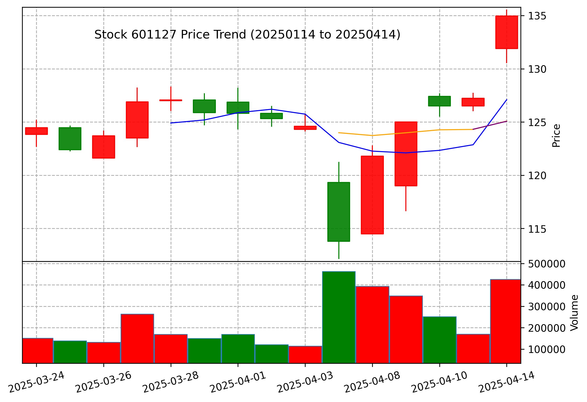

# A股分析助手

## 安装

### 安装依赖

```shell
pip install -r requirements.txt
```

同时也需要安装 `uv` 以及 `node.js` 以避免 error
可参考 [MCP Python SDK](https://github.com/modelcontextprotocol/python-sdk)

## 使用方法

### 在 Cursor/Windsurf 中使用

将以下配置添加到 Cursor/Windsurf 配置文件中：

```json
{
  "mcpServers": {
    "A股分析助手": {
      "command": "uv",
      "args": [
        "run",
        "--with",
        "akshare",
        "--with",
        "mcp[cli]",
        "mcp",
        "run",
        "YOUR_PATH/a_stock_mcp/main.py"
      ]
    }
  }
}
```

**建议使用 Cursor/Windsurf**，以便体验更加全面的 MCP 服务（包括自动生成 K线图，以及 Inner-LLM 智能分析）

### 作为 Claude MCP 插件使用（因为 Claude 环境问题，K线图生成和Inner-LLM功能无法使用，但不耽误其他所有分析/投资建议功能）

```shell
uv run mcp install claude_mcp.py
```

## 主要功能说明

### 获取个股财务数据

提供股票的基本信息、实时盘口数据、历史行情数据、财务分析等，包括：
- 股票基本信息（东方财富、雪球）
- 实时盘口数据
- 历史行情数据分析
- 技术指标计算（移动平均线、MACD等）
- 财务指标深入分析（市盈率、市净率、波动率、夏普比率等）
- 综合评分与投资建议

### 跟踪股价走势

生成股票 K 线图，并提供基本统计信息：
- 支持多种时间周期（日线、周线、月线）
- 自动计算技术指标（移动平均线等）
- 分析价格区间、涨跌幅、振幅等

### 分析市场新闻

结合市场新闻进行综合分析：
- 市场总体情况分析
- 行业交易情况分析
- 地区交易情况分析
- 个股价格趋势分析
- 资金流向分析
- 市场情绪与风险提示

### 综合分析报告

整合财务数据、市场新闻和股票走势，提供智能的投资建议：
- 财务数据深度分析
- 市场环境与行业趋势分析
- 技术面分析与预测
- 投资风险评估
- 综合投资建议

## 免责声明

本工具提供的分析结果仅供参考，不构成投资建议。投资决策需结合个人风险偏好和更全面的信息。投资有风险，入市需谨慎。


## 案例: 赛力斯汽车(601127)投资分析报告

**分析日期：2025年4月14日**

### 一、公司基本情况

#### 1.1 公司概况
- **企业名称：** 赛力斯集团股份有限公司
- **股票代码：** 601127
- **上市时间：** 2016年6月15日
- **主营业务：** 新能源汽车及核心三电等产品的研发、制造、销售及服务
- **行业分类：** 汽车整车
- **注册资本：** 16.33亿元
- **总股本：** 16.33亿股
- **流通股：** 15.10亿股
- **员工人数：** 18,838人
- **企业性质：** 民营企业

#### 1.2 市场表现
- **最新股价：** 134.96元
- **市值规模：** 2,204.39亿元
- **流通市值：** 2,037.60亿元
- **近期涨幅：** 30天涨幅10.17%
- **年度涨幅：** 56.51%
- **52周最高：** 137.98元
- **52周最低：** 112.14元

### 二、技术面分析

#### 2.1 价格走势分析
- **短期趋势：** 近期股价突破前期阻力位，短期呈现强势上行态势
- **中期趋势：** 形成良好的上升通道，中期趋势向好
- **长期趋势：** 处于上升周期，长期发展前景良好

  

#### 2.2 均线系统分析
- **5日均线：** 127.10元，股价站上5日均线，短期走势强劲
- **10日均线：** 125.09元，形成支撑位
- **20日均线：** 125.56元，股价站上20日均线，中期趋势偏强
- **60日均线：** 127.65元，基本持平，趋势不明确
- **均线排列：** 短期均线多头排列，但均线交叉，趋势需进一步确认

#### 2.3 技术指标
- **MACD：** DIF=0.1417, DEA=-0.7169, MACD柱=1.7172，金叉形成，买入信号初现
- **乖离率：** 相对20日均线乖离率为7.49%，短期存在回调可能
- **量比：** 1.31，成交量温和放大，市场关注度提升
- **换手率：** 2.82%，资金活跃度适中
- **波动率：** 近20交易日波动率3.17%，波动性较大，风险较高
- **年化波动率：** 0.54%，长期波动性控制良好

### 三、基本面分析

#### 3.1 行业分析
- **新能源汽车行业：** 处于高速发展阶段，国家政策持续支持
- **市场竞争格局：** 竞争激烈，主要对手包括特斯拉、比亚迪、蔚来、小鹏等
- **技术创新：** 智能化、电动化、网联化是行业主要趋势
- **政策环境：** 双碳目标下，新能源汽车产业获得政策红利

#### 3.2 公司核心优势
- **产品优势：** 华为深度合作，智能化程度高
- **技术积累：** 在三电系统领域有一定技术储备
- **品牌建设：** 品牌知名度逐步提升
- **渠道建设：** 销售网络布局合理，服务体系完善

#### 3.3 风险因素
- **市场竞争风险：** 新能源汽车市场竞争日趋激烈
- **技术迭代风险：** 技术更新换代速度快，研发投入大
- **原材料价格波动：** 电池原材料价格波动可能影响盈利能力
- **政策依赖风险：** 行业发展仍部分依赖政策支持

### 四、投资价值分析

#### 4.1 投资亮点
- **行业高景气：** 新能源汽车市场保持高速增长
- **战略合作：** 与华为深度合作，提升产品竞争力
- **市场表现：** 股价年涨幅显著，市场认可度高
- **技术研发：** 持续加大研发投入，保持技术竞争力

#### 4.2 投资风险
- **估值风险：** 当前估值水平较高，需警惕估值回调
- **业绩不确定性：** 新车型销量能否达预期存在不确定性
- **市场竞争加剧：** 价格战可能导致利润率下降
- **宏观经济风险：** 经济下行压力可能影响高端消费需求

### 五、投资建议

#### 5.1 投资策略
- **投资评级：** 审慎增持
- **适合人群：** 风险偏好中等、关注新能源汽车行业的投资者
- **持有周期：** 中长期(6-12个月)

#### 5.2 具体操作建议
- **入场时机：** 短期回调至125元附近考虑布局
- **持有策略：** 分批建仓，避免一次性大额投入
- **止损位置：** 设置在120元附近，严格执行止损策略
- **目标价位：** 中期目标145-150元，根据基本面变化调整

#### 5.3 关注要点
- **销量数据：** 密切关注月度销量数据变化
- **新车型推出：** 关注新车型上市时间及市场反响
- **产业政策：** 关注新能源补贴政策的调整方向
- **盈利能力：** 关注毛利率及净利率变化趋势

### 六、结论

赛力斯作为与华为合作紧密的新能源汽车企业，在当前新能源汽车高速发展的大背景下，具有一定的投资价值。公司股价近期表现强势，技术面指标向好，但考虑到估值水平较高及行业竞争加剧等因素，建议投资者保持谨慎乐观态度，采取分批建仓策略，中长期持有。

**风险提示：** 本报告中的分析及建议仅供参考，不构成任何投资建议。投资有风险，入市需谨慎。

---

*分析师：Claude*  
*报告日期：2025年4月14日*